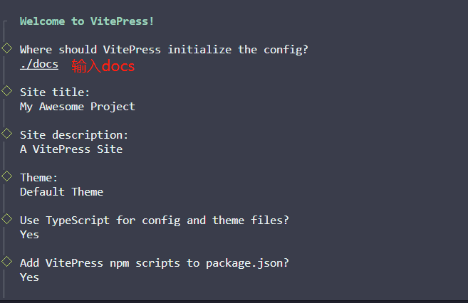
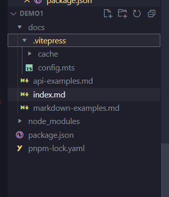
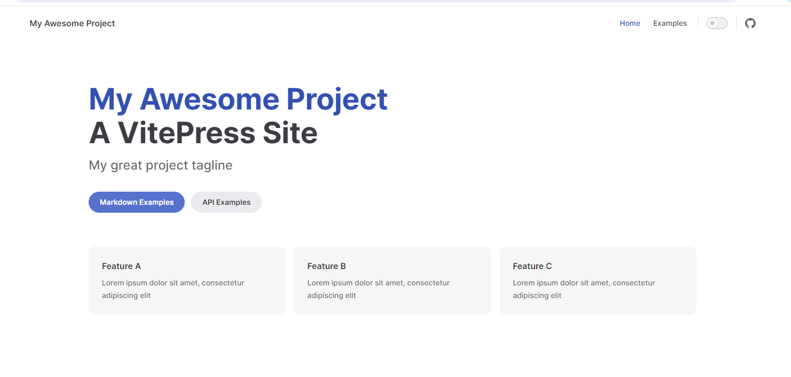
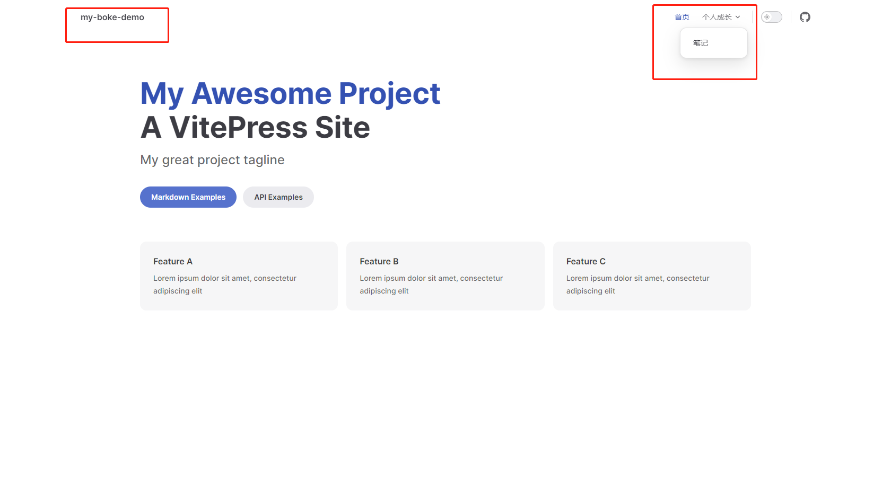
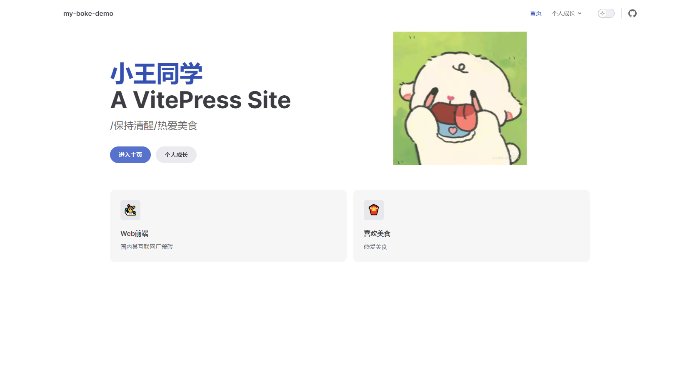
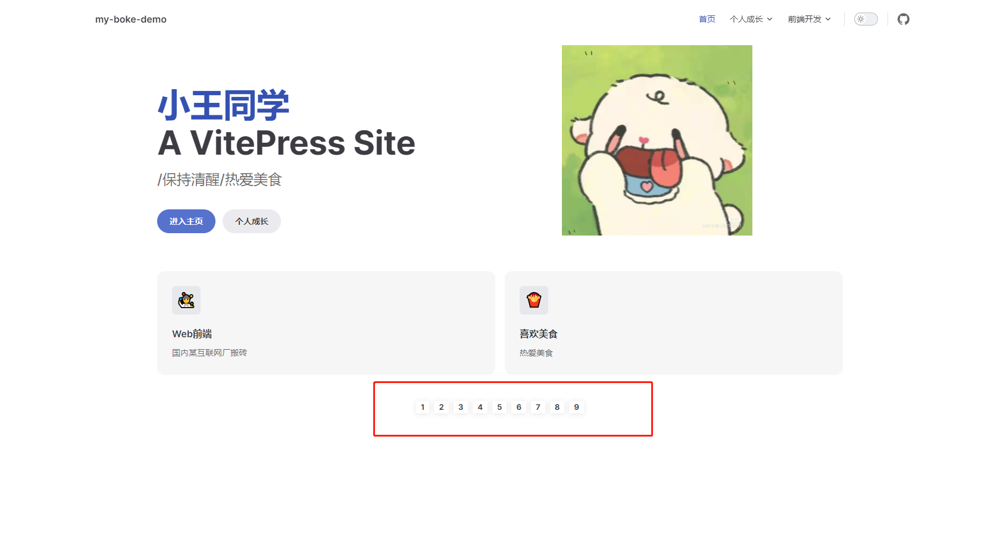
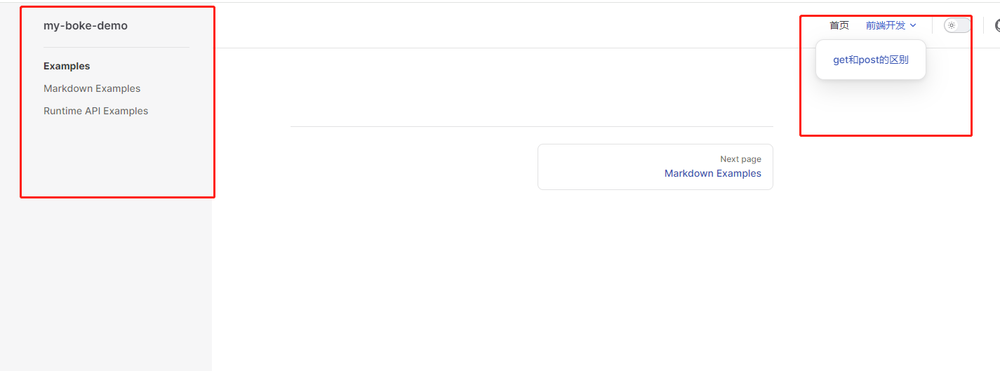
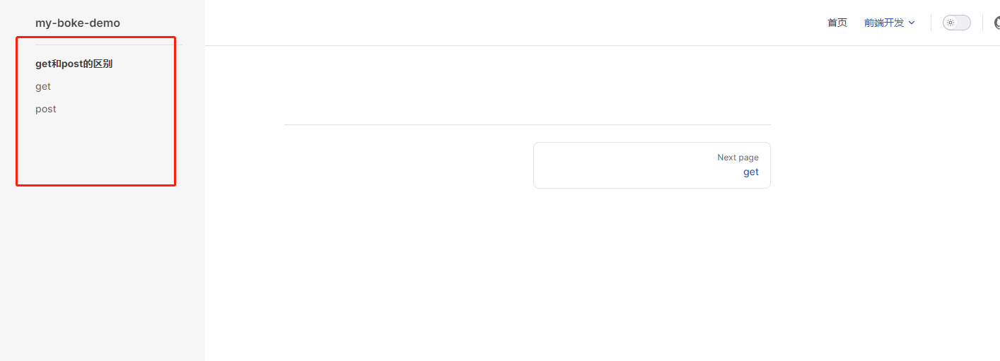
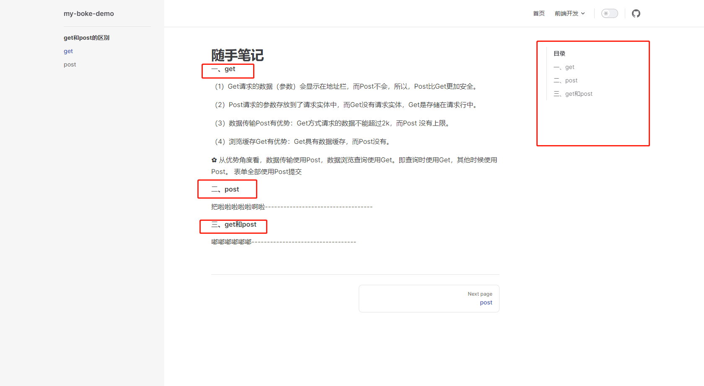
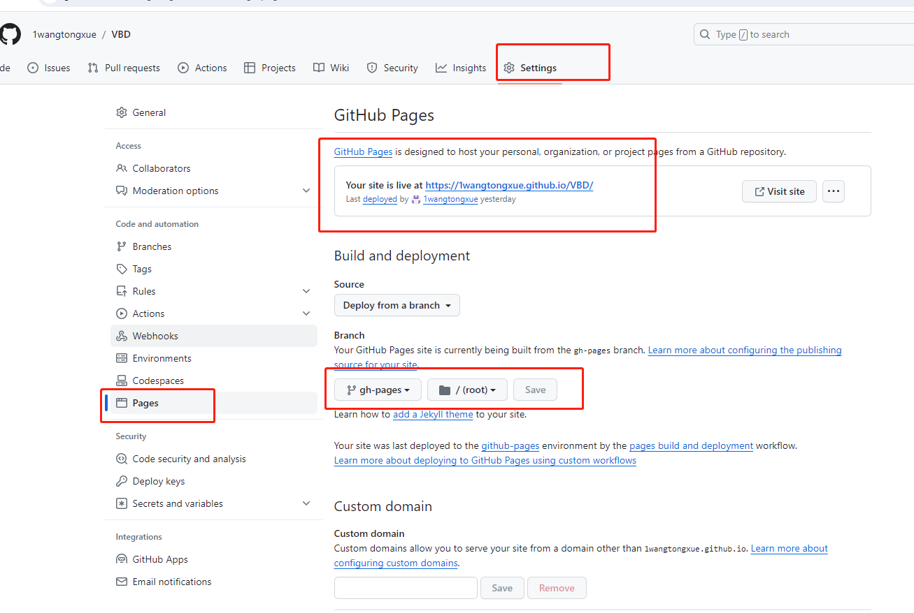

# vitepress 实现博客效果
学习并记录一些技术知识点

[//]: # (目前//可以简单的创建vitepress项目并部署到github上)
## vitepress官网
https://vitejs.cn/vitepress/
## 一、 博客搭建 
##### 1.1 首先创建并进入一个项目目录
```
 mkdir vitepressBokeDemo   &&    cd vitepressBokeDemo
```
##### 1.2 快速搭建
使用包管理器进行初始化，这个项目使用的是pnpm
```
# 如果没有安装过pnpm，可以全局安装下
sudo npm install -g pnpm

# 用pnpm初始化
pnpm init

```
项目初始化完成之后，进行安装vitepress依赖
 ```
#安装命令
pnpm add vitepress -D

#使用pnpm初始化，在package.json中增加
  "pnpm": {
    "peerDependencyRules": {
      "ignoreMissing": [
        "@algolia/client-search"
      ]
    }
  }
```

官网中有个命令行向导可以帮助构建项目
```
pnpm exec vitepress init
```
构建图如下：

文件的目录结构如下
<br/>
到这里基本完成了 **<font color="#ff8f9e"> vitepress</font>** 的初始化。
可以运行 **<font color="#ff8f9e">pnpm run docs:dev</font>** 运行项目，效果如下
<br/>

## 二、美化个人博客
##### 2.1 首页修改
**(1)修改左上角的title**
修改 **<font color="#ff8f9e">docs/.vitepress/config.mts</font>** 文件里的数据

```
export default defineConfig({
  title: "my-boke-demo",

```
**(2)右上角的导航自定义**
修改 **<font color="#ff8f9e">docs/.vitepress/config.mts</font>** 文件里的数据
```
export default defineConfig({
  title: "my-boke-demo",
  //将相关的导航栏信息传递进来
   nav: [],
   })
```
现在来定义下navbar的内容
```

// docs/.vitepress/relaConf/index.ts 由于配置内容较多，单起个文件
export * from './navbar';

//在docs/.vitepress/relaConf/navbar.ts中配置
import { DefaultTheme } from 'vitepress';

export const nav:DefaultTheme.NavItem[]=[
    {
        text: '首页',
        link: '/' // 表示docs/index.md
      },
      {
        text: '个人成长',
        items: [
          {
            text: '笔记',
            link: ' /views/tryIndex.md' // 表示docs/views/Travel/index.md
          },

        ]
      }
  ]
//在config.mts中引入并使用
import { nav } from './relaconf'

export default defineConfig({
  title: "my-boke-demo",
  //将相关的导航栏信息传递进来
   nav: nav,
   })
```
展示效果如下
<br/>
##### 2.2 首页home美化修改
home页也可以改成我们想要的效果

**(1)美化home页**
修改的文件位置在docs/index.md中,配置如下
```
---
# https://vitepress.dev/reference/default-theme-home-page
layout: home 
title: 小王同学 
lastUpdated: true
hero:
  name: "小王同学"
  text: "A VitePress Site"
  tagline: /保持清醒/热爱美食

//首页右边的图片  
  image:
    src: /head.jpg

//按钮相关配置    
  actions:
    - theme: brand
      text: 进入主页
      link: /
    - theme: alt
      text: 个人成长
      link: /views/tryIndex.md

//按钮下方的描述
features:
  - icon: 🤹 
    title: Web前端
    details: 国内某互联网厂搬砖人员
  - icon: 🍟
    title: 喜欢美食
    details: 热爱美食
  
---
```

好了，配置完来看下效果吧
<br/>
**(2)自定义组件**
如果想在home页下方增加一点图片啊图标之类的，就可以自定义组件，引入展示
例如在 **<font color="#ff8f9e">docs/.vitepress/components/home.vue</font>**
中创建个文件，写一些想要展示的代码
展示代码如下
```
<template>
    <div class="home-wrapper">
      <div v-for="item in list" :key="item" class="home-item" @click="changeBTN(item)">{{ item }}</div>
    </div>
  </template>

  <script >
  export default{
    data(){
      return{
        list :[1, 2, 3, 4, 5, 6, 7, 8, 9],
      }
    },
    methods:{
      changeBTN(val){
        console.log(val,"点击的某个标识div")
      }
    },
  }
  </script>

  <style scoped>
  .home-wrapper {
    display: flex;
    justify-content: center;
    margin-top: 40px;
  }
  .home-item {
    vertical-align: middle;
    margin: 4px 4px 10px;
    padding: 4px 8px;
    font-weight: bolder;
    display: inline-block;
    cursor: pointer;
    border-radius: 2px;
    line-height: 13px;
    font-size: 13px;
    box-shadow: 0 1px 8px 0 rgba(0, 0, 0, 0.1);
    transition: all 0.5s;
  }
  </style>


```

接着，在  **<font color="#ff8f9e">docs/index.md</font>** 中引入
```
<script setup>
    import homeIndex from "../docs/.vitepress/components/home.vue"
</script>
<homeIndex></homeIndex>
```
展示效果如下图所示
<br/>

##### 2.3 侧边栏美化
**(1)定义侧边栏**
先在navbar.ts中创建目录专栏叫  **<font color="#ff8f9e">get和post的区别</font>** 
```
export const nav: DefaultTheme.NavItem[] = [
    {
        text: '首页',
        link: '/' // 表示docs/index.md
      },
    {
    text: '前端开发',
    items: [
      {
        text: 'get和post的区别',
        link: '/column/Algorithm/' // 对应docs/column/Algorithm下的idnex.md文件
      }
    ]
  }

```
定义好的效果如下
<br/>
此时发现右边的侧边栏怎么莫名其妙的，其实这是我们初始化项目的时候，脚手架给我们预置好的侧边栏内容，对应的
是 **<font color="#ff8f9e">docs/.vitepress/config.ts</font>** 中的
**<font color="#ff8f9e">themeConfig.sidebar</font>**。接下来我们修改一下侧边栏的内容吧。

**(2)美化侧边栏**
在 **<font color="#ff8f9e">nvabar.ts</font>**
文件中配置如下代码
```
//配置代码
  export const sidebar: DefaultTheme.Sidebar = [
       // /column/Algothm/表示对这个文件夹下的所有md文件做侧边栏配置
       // 第一部分
       {
        text: 'get和post的区别',
        items: [
          {
            text: 'get',
            link: '/column/Algorithm/001_Stack'
          },
          {
            text: 'post',
            link: '/column/Algorithm/002_Queue'
          }
        ]
    }
]
```
引入到 **<font color="#ff8f9e">config.ts</font>** 中使用
```
//引入到config.ts中使用
import { defineConfig } from 'vitepress'
import { nav, sidebar } from './relaconf'
export default defineConfig({
themeConfig: {
    nav: nav,
    sidebar:sidebar , //侧边栏
    }
})
```
展示效果下图所示
<br/>

##### 2.4 锚点导航
锚点导航配置文件在 **<font color="#ff8f9e">config.ts</font>**  中，在
**<font color="#ff8f9e">themeConfig</font>**  中配置
**<font color="#ff8f9e">outline</font>** 具体代码如下
```
 themeConfig: {
    outline:{  //右边侧边栏的跳转目录
      level: [1, 60],
      label: '目录'
    },
```
具体展示如下图所示：
<br/>

## 三、部署到github page
到这里已经完成了一个简易的博客搭建，那么就发布上线吧。
采用 **<font color="#ff8f9e">github</font>** 进行部署项目<br/>
##### 3.1 设置公钥ssh 
要设置公钥ssh，要本地和远程仓库相连接。在网上找了个配置
https://blog.csdn.net/vxstar/article/details/131783270<br/>
##### 3.2 创建仓库-本地配置
使用 **<font color="#ff8f9e">github page</font>** 来部署
那么就有需要注意：新建仓库的时候选择 **<font color="#ff8f9e">public状态</font>。**<br/>
假如仓库名称为： **<font color="#ff8f9e">VBD</font>** (vitepressBokeDome的缩写)
那么我们需要到项目中的 **<font color="#ff8f9e">config.ts</font>** 文件中
去做配置。
```
export default defineConfig({
  base: "/VBD/", //这里是根路径
  )}
```
其次，写一个脚本，在根目录下创建一个文件夹 **<font color="#ff8f9e">vitepress-starter</font>**
，再创建一个 **<font color="#ff8f9e">deploy.sh</font>** 文件，
代码如下
```
#!/usr/bin/env sh

# 确保脚本抛出遇到的错误
set -e

# 生成静态文件
npm run docs:build

# 进入生成的文件夹
cd ../docs/.vitepress/dist

git init
git add -A
git commit -m 'deploy'

#git@github.com:1wangtongxue/VBD.git修改成自己的仓库名称
# 意思为将master构建后的代码合并到gh-pages分支上，然后在gh-pages分支上部署~
git push -f git@github.com:1wangtongxue/VBD.git master:gh-pages

cd -
```

完成后，就可以把调试好的代码，推到github上的master上，然后开始跑脚本，发布到生产环境。
运行代码如下：
```
git add .
git commit -m "first"
git push origin HEAD:refs/for/master
//在pack.json中配置
"docs:deploy": "sh vitepress-starter/deploy.sh"

//跑脚本 使用git bash 在vitepress-starter文件中使用命令跑脚本
sh ./vitepress-starter/deploy.sh

```
最后在仓库的 **<font color="#ff8f9e">setting——pages</font>** 中可以看到
要在分支切换成在对应的分支，点击Save按钮，它会在上面生成对应的连接，点击连接就可以访问了
<br/>


